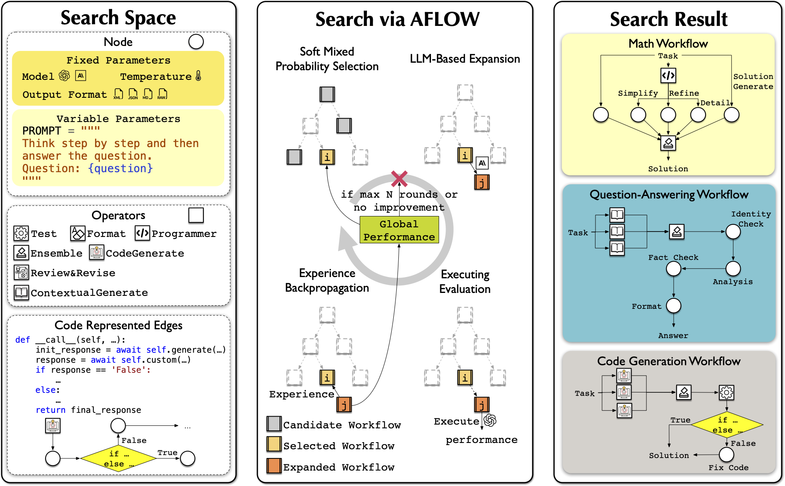
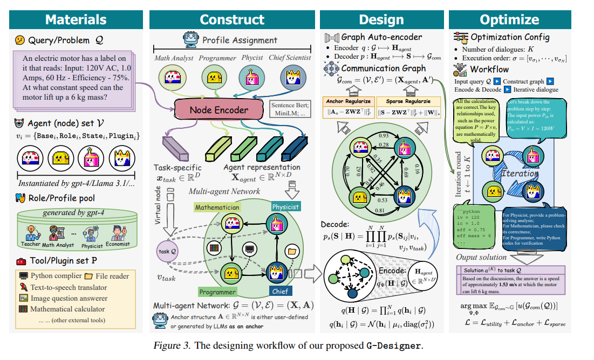
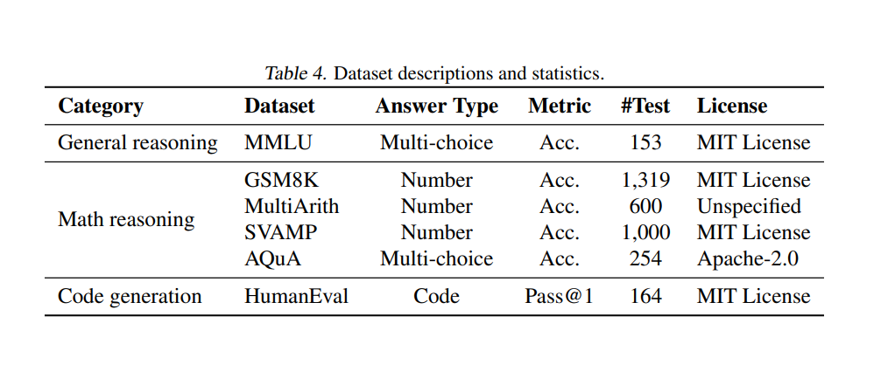
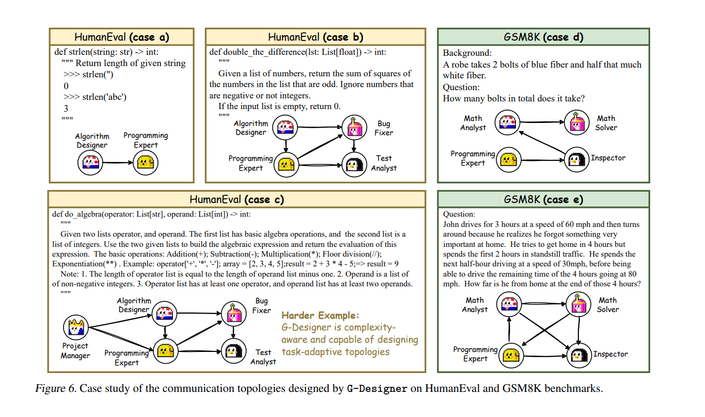
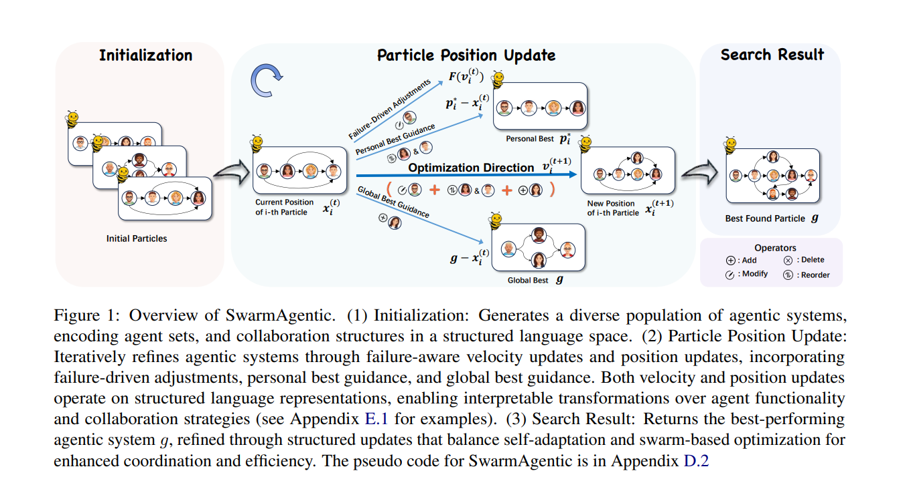
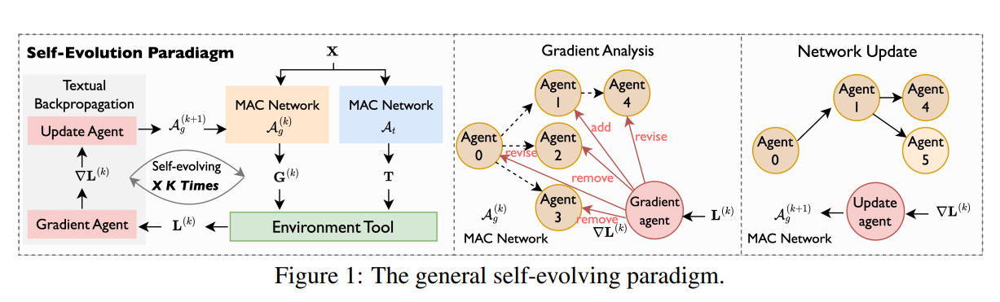
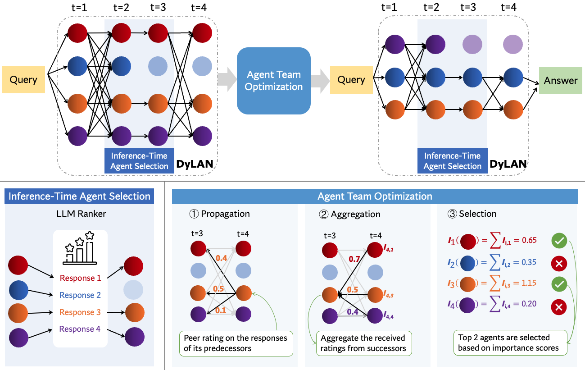
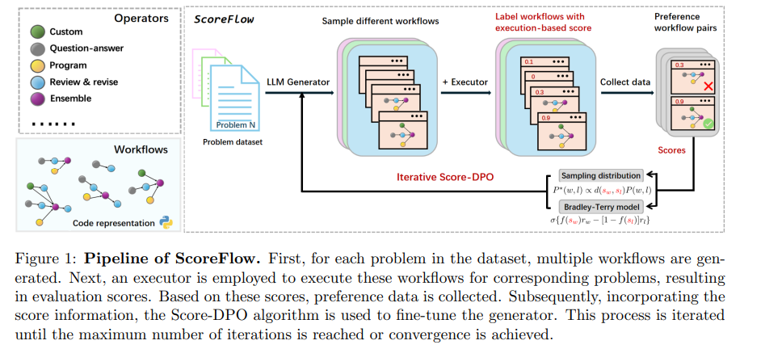
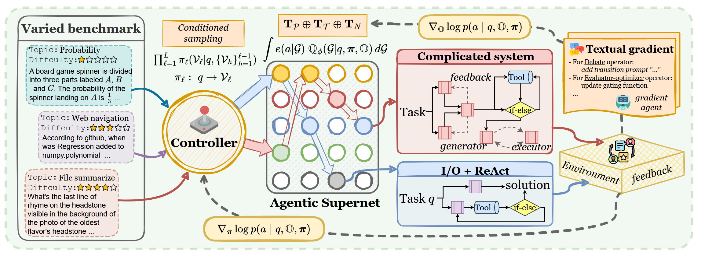

# Literature Review: Agentic Workflow Automation and Optimization

## 📰 AFLOW: Automating Agentic Workflow Generation
**Author(s):** Zhang et al.

**Year of Publication:** 2025  

**Link/DOI:** https://arxiv.org/pdf/2410.10762

### Intro/Summary

AFlow is a framework for automatically generating and optimizing Agentic Workflows. It uses Monte Carlo tree search in a code-represented workflow space to find effective workflows, replacing manual development with machine effort.

### Approach

Variant of Monte Carlo Tree Search:

1. Selection – Soft mixed-probability strategy balancing exploration and exploitation.
2. Expansion – LLM modifies existing workflows to generate new candidates.
3. Evaluation – Execute workflows and compute performance scores.
4. Backpropagation – Update tree with performance feedback.

Convergence determined by no performance improvement in top-K workflows for n rounds or reaching max iterations.

### Dataset
Evalauated on  HumanEval, MBPP, MATH, GSM8K, HotPotQA, and DROP datasets.

### Tags
Agentic Workflows, LLM Optimization, Monte Carlo Tree Search, Code Representations, Automation, Operators

## 📰 G-Designer: Architecting Multi-agent Communication Topologies via Graph Neural Networks

**Author(s):** Zhang et al.

**Year of Publication:** 2025 
**Link/DOI:** https://arxiv.org/pdf/2410.11782

### Intro/Summary

G-Designer proposes an LLM-powered multi-agent communication graph designer that dynamically crafts communication topologies based on task complexity. Uses a Variational Graph Auto-Encoder (VGAE) to learn task-specific communication topologies.

### Approach

#### Tools
* Graph Neural Networks: Variational Graph Auto-Encoder (VGAE) with GCN encoder for topology generation.

* Text Embedding Model: all-MiniLM-L6-v2 for encoding agent roles and tasks.
### Dataset

### Tags
Multi-agent Systems, LLM Agents, Communication Topology, Graph Neural Networks, Automated Workflow Design, Task Adaptation, Agent Coordination

## 📰 GNNs as Predictors of Agentic Workflow Performances

**Author(s):** Zhang et al.

**Year of Publication:** 2025 

**Link/DOI:** https://arxiv.org/pdf/2503.11301

### Intro/Summary
Proposes using GNNs as lightweight predictors of workflow performance by modeling workflows as computational graphs and proposes introduces FLOW-GNN, a GNN-based predictor.

### Approach
1. Workflows are modeled as graphs where nodes = agents, edges = task dependencies.
2. GNN encodes the workflow graph into a graph-level embedding
3. Task instruction is encoded into a dense vector
4. Graph and task embeddings are fused for performance prediction (binary success/failure).

#### Benchmark Construction (FLORA-Bench):

Curates workflows from optimization systems (G-Designer, AFLOW) and filters tasks for balanced difficulty.

Labels generated via LLM execution (unit tests for coding tasks for example).

### Dataset
* FLORA-Bench: 600K rows of workflow-task pairs across coding, math and reasoning. Also contains success/failure labels 

### Tags
Agentic Workflows, Graph Neural Networks, LLM Optimization, Benchmarking

## 📰 MAS-ZERO: Designing Multi-Agent Systems with Zero Supervision

**Author(s):** Ke et al.

**Year of Publication:** 2025  

**Link/DOI:** https://arxiv.org/pdf/2505.14996

### Intro/Summary
Dynamically generates, evaluates, and refines MAS configurations for each specific problem instance. The system uses a special meta-agent that works during the time it's solving a problem. This meta-agent creates, checks, and improves the MAS setup for each specific task.

### Approach

MAS-ZERO works in two main steps.

1. Meta iterations:
    *  Meta-agent breaks the problem into smaller, easier sub-tasks, then it designs a specific MAS, to solve each sub-task using a set of pre-made building blocks
    *  Meta-Feedback: The meta-agent looks at the results from the smaller sub-tasks to see how well the current MAS design is working. It checks two things: "solvability"  and "completeness". This feedback helps the meta-agent make a better design in the next round.

2. Self Verification: After multiple meta-iterations, which produce multiple candidate answers, the meta-agent selects the most suitable outcome. It does this by first ranking answers based on frequency and then selecting the best answer from the remaining candidates.

### Dataset
* Benchmarked using SWE-bench-lite, GPQA, AIME24

### Tags

Multi-Agent Systems, LLMs, Automatic MAS Design, Zero Supervision

## 📰 SwarmAgentic: Towards Fully Automated Agentic System Generation via Swarm Intelligence
**Author(s):** Zhang et al.

**Year of Publication:** 2025 

**Link/DOI:** https://arxiv.org/pdf/2506.15672

### Intro/Summary

Builds agentic systems from scratch and jointly optimizes both agent functionality and collaboration as interdependent components. The framework is inspired by Particle Swarm Optimization and uses a population of candidate systems that evolve through language-driven exploration and feedback-guided updates.

### Approach

### Dataset

* Benchmarked on TravelPlanner, Natural Plan and Creative Writing Benchmarks

### Tags

Multi-Agent Systems, LLMs, Particle Swarm Optimization, Automated System Design, Zero Supervision, Swarm Intelligence

## 📰 EvoAgentX: An Automated Framework for Evolving Agentic Workflows

**Author(s):** Wang et al.

**Year of Publication:** 2025 

**Link/DOI:** https://arxiv.org/pdf/2507.03616

### Intro/Summary

Open-source platform that automates the generation, execution, and evolutionary optimization of multi-agent workflows.

### Approach

The framework consists of layers:
1. **Agent Layer**: Each agent is a composition of an LLM, action modules, and memory components, supporting flexible, context-aware decision-making and tools.
2. **Workflow Layer**: Provides a structured way to build, orchestrate, and execute multi-agent workflows, which are modeled as a directed graph. It supports both a flexible WorkFlowGraph for complex task graphs and a simplified SequentialWorkFlowGraph for rapid prototyping
3. **Evolving Layer**: Consists of 3 main components:
    * **Agent Optimizer**: Refines agent prompts, tool configurations, and action strategies to enhance individual agent performance using optimizers like TextGrad and MIPRO.
    * **Workflow Optimizer**: Improves task decomposition and execution flow by adjusting the structure of the workflow graph using optimizers like AFlow.
    * **Memory Optimizer**: Its objective is to provide unstructured persistent memory modules that enable selective retention and priority based retrieval. Still under development.
4. **Evaluation Layer**: Provides a framework to systematically assess workflow performance using two components: a task-specific evaluator for domain-relevant metrics (e.g. F1 score for HotPotQA) and an LLM-based evaluator.

### Dataset
* Evaluated on HotpotQA, MBPP, MATH and GAIA datasets.

### Tags
Multi-Agent Systems, Automated Workflows, Evolutionary Optimization, LLMs, AFlow
### Notes

* Contains comprehensive github repository with tutorial video, with comprehensive documentation. 
* Github: https://github.com/EvoAgentX/EvoAgentX

## Automated Design of Agentic Systems
**Author(s):** Hu et al.

**Year of Publication:** 2025  

**Link:** https://arxiv.org/pdf/2408.08435

### Intro/Summary
Automated Design of Agentic Systems (ADAS) is a research area that aims to "automatically create powerful agentic system designs, including inventing novel building blocks and/or combining them in new ways." They utilize an algorithm called "Meta Agent Search," which iteratively programs new agents and evaluate them. Supported by code languages being Turing-complete, the meta agent is able to create different agent systems that cover every possibility. This includes not only prompts but workflows and tool use as well.

### Approach

A multi-agent system setup is built to implement the "Meta Agent Search" algorithm. The setup consists of a relatively simple framework with agents only having a "forward" function which allows them to communicate messages with the other agents in the system. The algorithm is as follows:

1. The archive is (optionally) initialized with baseline agents such as Chain-of-Thought and Self-Refine 

2. Conditioned on the archive, the meta agent designs a new agent by generating a high-level description of the new idea for an agentic system and then implementing it in code. The design then undergoes two self-reflection steps by the meta agent to ensure it is novel

3. The generated agent is evaluated using validation data from the target domain. If errors occur during evaluation, the meta agent performs a self-reflection step to refine the design, repeating this process up to five times if necessary

4. Finally, the agent is added to the archive along with its evaluation metrics, and the process continues with the updated archive until the maximum number of iterations is reached. 

### Dataset

Abstraction and Reasoning Corpus (ARC) Challenge,
DROP (Reading Comprehension), 
MGSM (Math capability under a multi-lingual setting), 
MMLU (Multi-task Problem Solving),
GPQA (solving hard (graduate-level) questions in Science)

### Tags
Search space, automation

### Notes
One of the pioneer paper in automating the building of multi-agent systems. Most other papers reference/build on this paper.

---

## GPTSwarm: Language Agents as Optimizable Graphs 

**Author(s):** Zhuge et al.

**Year of Publication:** 2024  

**Link:** https://arxiv.org/pdf/2402.16823

### Intro/Summary

GPTSwarm is an algorithm that converts multi-agent systems to computational graphs. The nodes are functionalities of the agents such as processing multimodal data or querying LLMs. Edges represent the data flow between these operations. The aim of this algorithm is to optimize both the nodes and edges of the graph. This is done by optimizing the prompts and making changes to the graph connectivity.

### Approach

1. Each agent is converted to a graph. The nodes include functionalities such as tool calls, function calls, LLM interactions, and more. Then these nodes are connected by edges which represent the execution topology.
2. A complex multi-agent system is formed as composite graphs (combining multiple graphs). Note that only DAGs are used for these composite graphs.
3. Given a function that maps a task to its utility, the goal is to optimize this graph. This is done by finding adding which edges maximizes utility. The search space is found by considering the set of all possible edges. Configurations that break the DAG property are excluded from this search space.
5. For this problem, continous optimization approach was taken due to complexity. Find the details on the paper
6. For each node, initialize an empty history set.
7. A random sample is executed on the graph. The history sets of the nodes are updated with the new input/context and output tuples.
8. According to the history, current prompt, and description of each node, their prompt is updated.

### Dataset

https://github.com/metauto-ai/gptswarm \
MMLU, Mini Crosswords, HumanEval, GAIA

### Tags
Optimization, swarm, graph, node, edge

### Notes
Optimizes both prompts and workflows. Workflow optimization uses continous optimization.

## SELF-EVOLVING MULTI-AGENT COLLABORATION NETWORKS FOR SOFTWARE DEVELOPMENT

**Author(s):** Hu et al.

**Year of Publication:** 2024 

**Link:** https://arxiv.org/pdf/2410.16946

### Intro/Summary

EvoMAC is a method to have self-evolving multi-agent systems. Inspired by traditional neural network training, EvoMAC obtains text-based environmental feedback by verifying the MAC network’s output against a target proxy and leverages a novel textual backpropagation to update the network. Other than this algorithm, they developed rSDE-Bench, a requirement-oriented software development benchmark, which features complex and diverse software requirements along with automatic evaluation of requirement correctness.

### Approach

### Dataset

https://github.com/yuzhu-cai/rSDE-Bench

### Tags
benchmark, self-evolving, back propagation

### Notes
A good paper on both optimizing the multi-agent systems and providing a benchmark for software developing purposes.

## A Dynamic LLM-Powered Agent Network for Task-Oriented Agent Collaboration

**Author(s):** Liu et al.

**Year of Publication:** 2024 

**Link:** https://arxiv.org/pdf/2310.02170

### Intro/Summary

Dynamic LLM-Powered Agent Network (DyLAN) is a framework that automates agent selection based on a pool of different agents. Based on the 'Agent Importance Score', the best agents are selected. Then, the new agents are collaborating given the query.

### Approach

### Dataset
https://github.com/SALT-NLP/DyLAN \
HumanEval, WebShop, MMLU, MATH

### Tags
tffn, optimization

### Notes

This uses Temporal Feed-Forward networks to represent the multi-agent system executions as graphs. 

## ScoreFlow: Mastering LLM Agent Workflows via Score-based Preference Optimization

**Author(s):** Wang et al.

**Year of Publication:** 2025 

**Link:** https://arxiv.org/pdf/2502.04306

### Intro/Summary

ScoreFlow is a simple yet highperformance framework that leverages efficient gradient-based optimization in a continuous space. ScoreFlow incorporates Score-DPO, a novel variant of the direct preference optimization method that accounts for quantitative feedback.

### Approach

### Datasets

https://github.com/Gen-Verse/ScoreFlow \
HumanEval, MBPP, GSM8K, MATH, DROP, HotpotQA

### Tags
score, benchmark, gradient-based

## Multi-agent Architecture Search via Agentic Supernet 

**Author(s):** Zhang et al.

**Year of Publication:** 2025 

**Link:** https://arxiv.org/pdf/2502.04180

### Intro/Summary

MaAS framework is developed, which aims to optimize the whole agent supernet. This supernet basically is a distribution of whole agentic systems. MaAS samples agentic systems from this supernet and create the solutions. 

### Approach

### Datasets

https://github.com/bingreeky/MaAS \
GSM8K, MATH, MultiArith, HumanEval, MBPP, GAIA

### Tags
self-evolve, agentic supernet, optimization

### Notes
This method is interesting as a single system but an agentic supernet is optimized.
